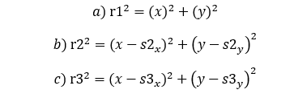
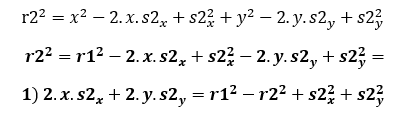
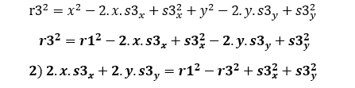
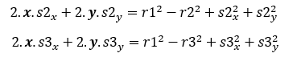
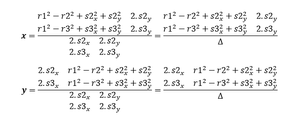
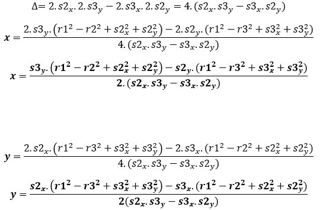

# Operación Fuego de Quasar

Reto Meli por Felix Antonio Sirit Murillo siritfelix@gmail.com

## Solucion matematica

EL reto consiste en determinar la ubicacion de una fuente y el contenido de un mensaje oculto, se emplean 3 satelites, que proveen de la distancia a la fuente. Se conoce la ubicacion de los satelites.


Para dar solución al problema , podemos identificar que se trata de una trilateración de posición,  se tienen las coordenadas de los tres satélites, y las diferentes distancias hacia la fuente, este problema se emplean cónicas, para este caso la ecuación de una circunferencia. Dados tres puntos y distancias hacia el objetivo (radio), nos lleva a tres circunferencias, donde la intercepción de las mismas, pudiera ser un solo punto coherente, que no resultaría la ubicación de la fuente. Para simplificar las ecuaciones, hacemos una traslación de coordenadas asumiendo como origen el primer satélite (kenobi), luego de los cálculos se realiza el reajuste de coordenadas para ajustar a la ubicación real y no relativa. Partiendo de la ecuación de las cónicas en este caso la circunferencia, donde el radio representaría la distancia del satélite a la fuente, el desafío es plantear un sistema de ecuaciones basado en ecuación de circunferencia. Como se pudiera notar la ecuación de circunferencia es una ecuación cuadrática, por
lo que al combinar 2 de ellas, nos resultaría 2 pares de puntos de ubicación, por ello es necesario un tercer satélite para poder triangular bien la posición.

La ecuación **a** representa la circunferencia que daría desde el origen de coordenadas con un radio que representa la distancia entre el satélite (kanobi) y la fuente, aclarando que se hizo una traslación de
coordenadas para tomar como referencia el primer satélite.

La ecuación **b**, representa la representa la circunferencia que daría desde el la ubicación relativa con respecto al satélite (kanobi) donde el radio que representa la distancia entre el satélite (Skywalker)   y la fuente. Del mismo modo se aplica al ecuación **c**, que representa la función desde el satélite (Sato):



*Se Resuelve la ecuación (b) y se agrupa x^2 y y^2 e igualar con la ecuación (a)*



*Se Resuelve la ecuación (c) y se agrupa x^2 y y^2 e igualar con la ecuación (a)*




*Al final se obtiene 2 ecuaciones lineales* *Se puede aplicar cualquier método de simplificación y solución a las ecuaciones, en este caso usare el método de Cramer (determinantes )*





*Resolvemos el determinante del sistema, denominador común en x,y*



*Al final se obtienen la soluciones al sistema.*

*Es preciso mencionar que a pesar de en la mayor parte de los escenarios planteados , se puedan
obtener resultados, pero no necesariamente coherentes, en las ecuaciones la única forma de identificar un error es que el denominador sea cero, esto se pude validar, pero no solo eso, se pueden obtener valores en los cálculos pero la verificación mas veras para obtener resultados lógicos , es comparar las distancias previamente dadas, con las que nos resultaría calcular con el valor de posición obtenido, tomando un margen de error, ya que los cálculos por contener punto flotantes,  los mismo son truncados por el computador , por tomar un margen aceptable en los cálculos, se tomara 5% de error, para validar la coherencia del resultado.*

## EndPoint Publicados

Determina la ubicacion y mensaje, ingresando la distancia de los tres satelites.

* POST : https://quasarmelisfisirit.herokuapp.com/topsecret/

Ejemplo:

Entrada

```

{
    "satellites": [
        {
            "name": "kenobi",
            "distance": 538.516,
            "message": [
                "",
                "este",
                "es",
                "un",
                "mensaje"
            ]
        },
        {
            "name": "skywalker",
            "distance": 141.42,
            "message": [
                "este",
                "",
                "un",
                "mensaje"
            ]
        },
        {
            "name": "sato",
            "distance": 511,
            "message": [
                "",
                "",
                "es",
                "",
                "mensaje"
            ]
        }
    ]
}
```

Respuesta Ok (200)

```
{
    "position": {
        "x": 0.7007446,
        "y": -4.2048035
    },
    "menssage": "este es un mensaje"
}
```

Respuesta NoFound (404)

```
{
    "position": null,
    "menssage": null
}
```

Agrega datos de distancia y mensaje al satelite especificado como parametro satellite_name y json con contenido de los datos.

* POST https://quasarmelisfisirit.herokuapp.com/topsecret_split/?satellite_name=Kenobi

```
{
"distance": 538.516,
            "message": [
                "",
                "este",
                "es",
                "un",
                "mensaje"
            ]
}
```


Determina la ubicacion y mensaje, sin valores ingresados, los mismo previamente debieron ser cargados emplando los metodos anteriormes.

* GET https://quasarmelisfisirit.herokuapp.com/topsecret_split/

Respuesta similar al primer POST
